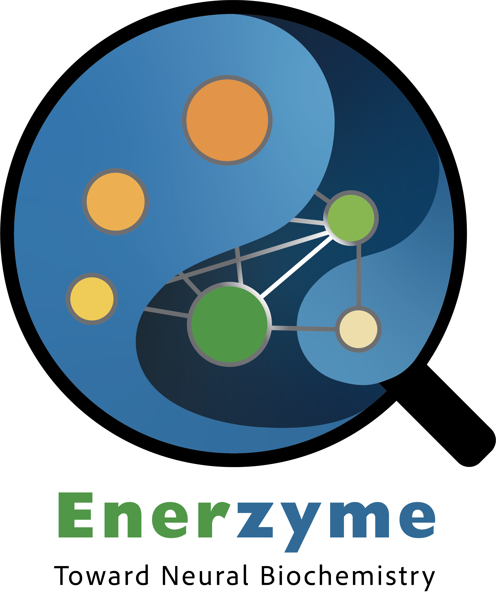

# Enerzyme

<h1>
<p align="center">
    
</p>
</h1>

Towards next-generation computational enzymatic catalysis with neural network potentials.

Currently supported model architectures:

|   Model   |   Type   | Energy and force prediction | Charge and dipole prediction | Fully modulized | Shallow ensemble |                                           Reference paper                                           |               Reference code               |
| :-------: | :------: | :-------------------------: | :--------------------------: | :-------------: | :--------------: | :-------------------------------------------------------------------------------------------------: | :----------------------------------------: |
|  PhysNet  | internal |             ✅             |              ✅              |       ✅       |        ✅        | [J. Chem. Theory Comput. 2019, 15 (6), 3678–3693.](https://pubs.acs.org/doi/full/10.1021/acs.jctc.9b00181) | [Github](https://github.com/MMunibas/PhysNet) |
| SpookyNet | internal |             ✅             |              ✅              |       ✅       |        ✅        |          [Nat. Commun. 2021, 12(1), 7273](https://www.nature.com/articles/s41467-021-27504-0)          | [Github](https://github.com/OUnke/SpookyNet) |
|  AlphaNet | internal |             ✅             |              ✅              |       ❌       |        ❌        |                   [arXiv:2501.07155](https://arxiv.org/abs/2501.07155)                   |  [Github](https://github.com/yuanqidu/M2Hub)  |
|   MACE   | internal |             ✅             |              ✅              |       ❌       |        ✅        |                   [NeurIPS 2022, arXiv:2206.07697](https://arxiv.org/abs/2206.07697)                   |   [Github](https://github.com/ACEsuit/mace)   |
|  NequIP  | external |             ✅             |              ❌              |       ❌       |        ❌        |          [Nat. Commun. 2022, 13(1), 2453](https://www.nature.com/articles/s41467-022-29939-5)          | [Github](https://github.com/mir-group/nequip) |
|  XPaiNN  | external |             ✅             |              ❌              |       ❌       |        ❌        | [J. Chem. Theory Comput. 2024, 20, 21, 9500–9511](https://pubs.acs.org/doi/10.1021/acs.jctc.4c01151) | [Github](https://github.com/X1X1010/XequiNet) |
|  SchNet  | internal |             ✅             |              ✅              |       ❌       |  ✅       |  [NeurIPS 2017, arXiv: 1706.08566](https://arxiv.org/abs/1706.08566) | [Github](https://github.com/pyg-team/pytorch_geometric/blob/master/torch_geometric/nn/models/schnet.py) |
## Usage

### Installation

Recommended environment for internal force fields

```
python==3.13.5
pip==25.2
setuptools==80.9.0
h5py==3.14.0
numpy==2.3.5
addict==2.4.0
tqdm==4.67.1
joblib==1.5.1
pandas==2.3.2
torch==2.8.0
scikit-learn==1.7.1
ase==3.27.0
transformers==4.55.4
torch-ema==0.3
pyyaml==6.0.2
torch-scatter==2.1.2
e3nn==0.5.6
torch-geometric==2.6.1
flask==3.1.2
waitress==3.0.2
```

To test PhysNet, you also need

```
tensorflow==2.13.0
```


To invoke NequIP, you need

```
nequip==0.6.1
```

To invoke XPaiNN, you need

```
XequiNet==0.3.6
scipy==1.11.2
pyscf==2.7.0
pytorch-warmup==0.1.1
pydantic==1.10.12
```

Then install the package

```bash
pip install -e .
```

### Training

Energy (force) / Atomic Charge / Dipole moment fitting.

```bash
enerzyme train -c <configuration yaml file> -o <output directory>
```

Please see `enerzyme/config/train.yaml` for details and recommended configurations.

Enerzyme saves the preprocessed dataset, split indices, final `<configuration yaml file>`, and the best/last model to the `<output directory>`.

#### Active Learning Training

Please see `enerzyme/config/active_learning_train.yaml` for details and recommended configurations.

### Evaluation

Energy (force) / Atomic Charge / Dipole moment prediction.

```bash
enerzyme predict -c <prediction configuration yaml file> -o <output directory> -m <model directory> -mc <model configuration yaml file>
```

Please see `enerzyme/config/predict.yaml` for details.

Enerzyme reads the `<model directory>` for the model configuration, load the models, predict the results from all active models, save the predicted values as a pickle in the corresponding model subfolders, and report the results as a csv file in the `<output directory>`.

### Simulation

Supported simulation types:

- Constrained optimization. See `enerzyme/config/opt.yaml`
- Constrained flexible scan on the distance between two atoms. See `enerzyme/config/scan.yaml`
- Constrained Langevin MD. See `enerzyme/config/nvt_md.yaml`
- NEB. See `enerzyme/config/neb.yaml`
- Enhanced sampling with plumed. See `enerzyme/config/plumed.yaml`. (Requires py-plumed)

```bash
enerzyme simulate -c <simulation configuration yaml file> -o <output directory> -m <model directory> -mc <model configuration yaml file>
```

Enerzyme reads the `<model directory>` for the model configuration, load the models, do simulation, and report the results in the `<output directory>`.

### Fragment Extraction

Extract fragments based on local uncertainty from the prediction

```bash
enerzyme extract -c <extraction configuration yaml file> -o <output directory> -m <model directory> -mc <model configuration yaml file>
```

Please see `enerzyme/config/extract.yaml` for details.

### Data annotation

Label molecules with energies, forces and dipoles from QM calculation. Please get your QM engine's environment prepared first.

```bash
enerzyme annotate -c <configuration yaml file> -o <output directory> -t <temporary directory> -s <start index> -e <end index>
```

Please see `enerzyme/config/annotate.yaml` for details.

### Bond order assignment

Guess bond orders from pdb file. Compatible with [QuantumPDB](https://github.com/davidkastner/quantumPDB), where the pdb file should be the output of cluster building and the template sdf file should be ligands.sdf.

```bash
enerzyme bond -p <pdb file> -m <output mol file> -i <output image file> -t <template sdf file>
```

### Server mode

Open a server that respond to requests for prediction. It is more powerful to be combined with the [Enerzymette workflow manager](https://github.com/Benzoin96485/Enerzymette).

```bash
enerzyme listen -c <server configuration yaml file> -m <model directory> -o <output directory> -b <bind address> -mc <model configuration yaml file>
```

### Client mode

Send requests to the server for prediction.

```bash
enerzyme request -u <server url> -f <input file format> -i <input file> -k <model key>
```

### Copyright

Copyright (c) 2024-2026, Weiliang Luo, Kulik Group, MIT


#### Acknowledgements
 
Project based on the 
[Computational Molecular Science Python Cookiecutter](https://github.com/molssi/cookiecutter-cms) version 1.11.